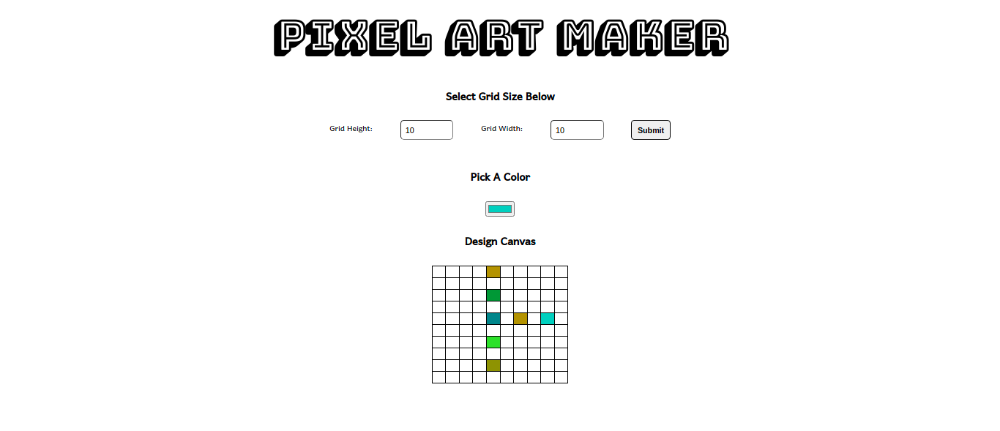

# Read Me Template

---

### Table of Contents

- [Description](#description)
- [Technologies](#Technologies)
- [How To Use](#how-to-use)
- [References](#references)

---

## Description

A pixel art maker that:

- Generate a grid of rows and columns 
- Apply any selected color on the cells of the generated grid

#### Technologies

- HTML5
- CSS
- Javascript

---

## How To Use
   Drag and drop the index.html file on a browser.
---

## References
* [Udacity Nanodegree](https://www.udacity.com/course/intro-to-programming-nanodegree--nd000)

[Back To The Top](#read-me-template)